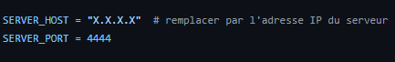
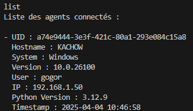

# Command & Control (C2) Documentation

## Avertissement légal et de sécurité

**Attention :** Ce projet est fourni à des fins éducatives et de recherche uniquement. Toute utilisation de ce programme pour des activités illégales ou non autorisées est strictement interdite. L'auteur décline toute responsabilité pour les dommages ou conséquences résultant d'une utilisation abusive de ce code. Assurez-vous d'avoir l'autorisation explicite des parties concernées avant de déployer ce programme dans un environnement réel.

## Procédure d'installation

1. **Pré-requis** :
   - Python 3.x installé sur le serveur et les agents.
   - Certificat SSL (`server.crt`) et clé privée (`server.key`) pour sécuriser les communications.

2. **Récupération des fichiers** :
   - git clone https://github.com/Tw1ny-dot/Command-Control.git
   - cd Command-Control

3. **Installation du serveur** :
   - Placez le fichier `Server.py` sur la machine qui jouera le rôle de serveur.
   - Assurez-vous que le fichier `clients.json` est dans le même répertoire pour stocker les informations des agents. Il sera créer lors du premier lancement du serveur.

4. **Installation de l'agent** :
   - Placez le fichier `agent.py` sur les machines cibles.
   - Configurez l'adresse IP et le port du serveur dans le fichier `agent.py` (variables `SERVER_HOST` et `SERVER_PORT`).
     
   - Exécutez le script pour démarrer l'agent.

5. **Lancer le serveur** :
   - Exécutez la commande suivante dans un terminal :
     ```bash
     python Server.py <IP> <PORT>
     ```
   - Remplacez `<IP>` par l'adresse IP du serveur et `<PORT>` par le port à utiliser.
   - Exemple :
     ```bash
     python Server.py 192.168.1.100 8080
     ```

## Fonctionnalités

### Serveur
- **Gestion des agents connectés** :
  - Liste les agents connectés avec leurs informations système.
  - Stocke les informations des agents dans un fichier JSON pour persistance.
- **Envoi de commandes** :
  - Envoi de commandes spécifiques à un agent ou à tous les agents connectés.
  - Gestion des commandes en attente pour les agents déconnectés.
- **Journalisation des résultats** :
  - Stocke les résultats des commandes exécutées par les agents dans un fichier texte.

### Agent
- **Envoi d'informations système** :
  - Envoie des informations détaillées sur le système (UID, hostname, OS, IP, etc.) au serveur.
- **Exécution de commandes** :
  - Reçoit et exécute les commandes envoyées par le serveur.
  - Retourne les résultats de l'exécution au serveur.
- **Démarrage automatique** :
  - Ajoute le script au démarrage du système (Windows : dossier Startup, Linux : tâche cron).

## Commandes utilisables

### Commandes serveur
- `exit` : Arrête le serveur.
- `list` : Affiche la liste des agents connectés avec leurs informations.  
  
- `cmd_all <commande>` : Envoie une commande à tous les agents connectés.
- `cmd <uid> <commande>` : Envoie une commande à un agent spécifique identifié par son UID.

### Commandes agent
- `GET_COMMAND` : L'agent demande automatiquement toutes les 10 secondes si le serveur a des commandes a executer

## Fonctionnement

### Serveur

#### `start_server(host, port)`
- Démarre un serveur sécurisé avec SSL.
- Accepte les connexions des agents et démarre un thread pour chaque client.

#### `handle_client(client_socket)`
- Gère les communications avec un agent.
- Reçoit les informations système, enregistre les résultats des commandes et envoie des commandes en attente.

#### `server_commands(server)`
- Gère les commandes administratives du serveur (list, cmd, etc.).

#### `update_or_add_client(filename, client_info)`
- Met à jour ou ajoute les informations d'un agent dans le fichier JSON.

#### `load_clients_from_json(filename)`
- Charge les informations des agents depuis un fichier JSON en cas de redémarrage.

### Agent

#### `start_agent()`
- Établit une connexion sécurisée avec le serveur.
- Envoie les informations système et exécute les commandes reçues.

#### `get_system_info()`
- Récupère les informations système de l'agent (UID, OS, IP, etc.).

#### `get_or_create_uid()`
- Génère un UID unique pour l'agent ou le récupère depuis un fichier local.

#### `add_to_startup()` / `create_cron_job()`
- Configure le démarrage automatique de l'agent (Windows/Linux).

## Notes
- Les communications entre le serveur et les agents sont sécurisées via SSL.  
  
- Assurez-vous que les ports nécessaires sont ouverts sur le pare-feu.
- Utilisez ce programme uniquement dans un cadre légal et avec l'autorisation des parties concernées.
